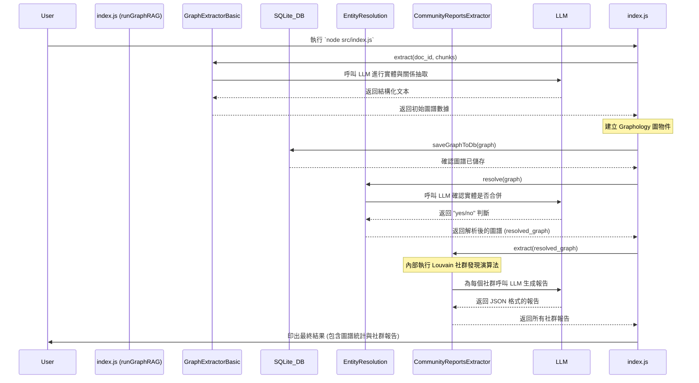

# Node.js GraphRAG 實作說明

此專案將 GraphRAG 概念在 Node.js 環境實作， 進行快速的開發與驗證，並整合SQLite全文檢索功能、加入查詢組合策略。

## 快速開始

### 1. 安裝套件
```bash
npm install
```

### 2. 設定 API 金鑰
```bash
export GEMINI_API_KEY=your_actual_api_key_here
```

### 3. 載入資料
```bash
# 使用統一載入腳本（推薦）
node scripts/load_data.js test_data.csv --mode standard --rows 10

# 或使用個別腳本
node scripts/load_custom_data.js test_data.csv 10
```

### 4. 執行水滸傳資料示範
```bash
# 執行完整的 GraphRAG 流程示範（使用水滸傳資料 https://zh.wikisource.org/wiki/%E6%B0%B4%E6%BB%B8%E5%82%B3_(120%E5%9B%9E%E6%9C%AC)/%E7%AC%AC020%E5%9B%9E）
node water_margin_demo.js
```

此腳本會：
- 讀取 `Water_Margin.md` 檔案
- 執行完整的 GraphRAG 流程（圖形提取、實體解析、社群報告）
- 產生視覺化 HTML 檔案
- 在瀏覽器中顯示結果

### 5. 快速重建（推薦）
```bash
# 完全清空並重建 GraphRAG 流程
node scripts/rebuild_all.js
```

此腳本會：
- 自動檢查必要檔案
- 清空現有資料（資料庫、快取、暫存檔案）
- 執行完整的 GraphRAG 流程
- 驗證重建結果
- 顯示統計資訊

**⚠️ 執行時間說明：**
- **總執行時間**: 約 10-30 分鐘（依資料量和網路狀況而定）
- **最耗時步驟**: 圖形提取和實體解析（約 8-25 分鐘）
- **Timeout 設定**: 45 分鐘自動終止
- **建議**: 在網路穩定時執行，避免中斷

### 6. 完全清空
```bash
# 清空所有資料
node scripts/clear_all.js
```

此腳本會：
- 清空 SQLite 資料庫
- 清空 LLM 快取檔案
- 刪除暫存檔案
- 顯示清空後的狀態

### 7. 啟動視覺化介面
```bash
node server.js
```

開啟瀏覽器前往：http://localhost:3000

**⚠️ 重要說明：**
- **查詢功能**: 必須透過 `server.js` 執行才能使用 LLM 查詢功能
- **視覺化檔案**: `graph_visualization.html` 會在每次重建時重新生成
- **即時查詢**: 網頁介面支援即時圖譜查詢和搜尋

## 專案架構

專案的程式碼都位於 `src` 資料夾中，其結構設計旨在將不同的功能模組化。

```
graphrag-node-dev/
├── node_modules/
├── src/
│   ├── index.js                # 主入口與流程協調器
│   ├── utils.js                # 核心工具函式 (字串處理、LLM 回應解析)
│   ├── prompts.js              # 存放所有與 LLM 互動的 Prompt 模板
│   ├── llm-service.js          # LLM 服務管理（API 呼叫、快取、重試）
│   ├── llm-cache.js            # LLM 快取機制
│   ├── fulltext-search.js      # 全文檢索功能（新增）
│   ├── extractors/
│   │   ├── base-extractor.js   # 抽取器的基礎類別，定義通用邏輯
│   │   ├── graph-extractor-basic.js # 基礎圖譜抽取器的具體實作
│   │   └── graph-extractor-general.js # 通用圖譜抽取器
│   ├── entity-resolution.js    # 實體解析與合併邏輯
│   └── community/
│       ├── community-reports-extractor.js # 社群發現與報告生成
│       └── leiden.js           # Leiden 社群發現演算法
├── scripts/                    # 資料載入與管理腳本
│   ├── load_data.js            # 統一載入腳本（推薦使用）
│   ├── load_custom_data.js     # 標準載入腳本
│   ├── load_custom_data_fixed.js # 修復模式載入腳本
│   ├── load_custom_data_slow.js # 慢速載入腳本
│   ├── load_custom_data_ultra_slow.js # 超慢速載入腳本
│   ├── load_custom_data_robust.js # 穩健載入腳本
│   ├── clear_all.js            # 完全清空腳本（新增）
│   ├── rebuild_all.js          # 完整重建腳本（新增）
│   └── manage_cache.js         # 快取管理腳本
├── visualization/              # 視覺化相關檔案
│   ├── graph_visualization.html # 圖譜視覺化頁面
│   └── template.html           # 視覺化模板
├── server.js                   # 視覺化伺服器
├── clear_database.js           # 資料庫清空腳本
├── search_graph.js             # 圖譜搜尋腳本（整合全文檢索）
├── water_margin_demo.js        # 水滸傳資料示範腳本
├── package.json
├── graphrag.db                 # SQLite 資料庫檔案
├── llm_cache/                  # LLM 快取目錄
├── test_data.csv               # 測試資料
├── Water_Margin.md              # 水滸傳示範資料
├── FAQ.md                      # 常見問題與解答
├── README_資料載入.md          # 資料載入詳細指南
├── README_全文檢索.md          # 全文檢索功能說明
└── scripts/README.md           # 腳本使用說明
```

### 檔案職責

#### 核心模組
-   **`src/index.js`**: 整個 GraphRAG 流程的**協調器 (Orchestrator)**。它負責依序呼叫各個模組，從圖譜抽取、存入資料庫、實體解析到社群報告生成。
-   **`src/utils.js`**: 提供專案中重用的核心工具函式，例如清理字串、解析 LLM 回傳的結構化文本等。
-   **`src/prompts.js`**: 集中管理所有 Prompt 模板，將指導 LLM 執行的指令與業務邏輯分離。

#### LLM 服務
-   **`src/llm-service.js`**: LLM 服務管理，包含 API 呼叫、快取機制、重試邏輯和錯誤處理。
-   **`src/llm-cache.js`**: LLM 快取機制，避免重複的 API 呼叫，提升效能並節省成本。

#### 圖譜處理
-   **`src/extractors/base-extractor.js`**: 定義了抽取器的通用行為，包含與 LLM 的互動、並行處理文本區塊 (chunks)、以及合併節點與邊的基礎邏輯。
-   **`src/extractors/graph-extractor-basic.js`**: 繼承自 `base-extractor`，實作了從文本中抽取實體（節點）和關係（邊）的具體邏輯。
-   **`src/extractors/graph-extractor-general.js`**: 通用圖譜抽取器，提供更靈活的抽取策略。
-   **`src/entity-resolution.js`**: 負責圖譜的**清理與優化**。它會找出圖中可能代表同一個真實世界實體的節點（例如 "TV" 和 "Television"），並將它們合併。

#### 全文檢索
-   **`src/fulltext-search.js`**: 全文檢索功能，支援多種搜尋策略（bigram、關鍵字匹配、模糊搜尋），特別針對中文搜尋進行優化。

#### 社群分析
-   **`src/community/community-reports-extractor.js`**: 負責在圖譜上進行**社群發現 (Community Detection)**，找出關聯緊密的實體群組，並使用 LLM 為每個社群生成一份摘要報告。
-   **`src/community/leiden.js`**: Leiden 社群發現演算法的實作，用於高效能的社群劃分。

#### 資料載入腳本
-   **`scripts/load_data.js`**: 統一載入腳本，支援多種載入模式（standard、slow、ultra-slow、robust、fixed）。
-   **`scripts/load_custom_data*.js`**: 各種特定用途的載入腳本，提供不同的處理策略。
-   **`scripts/clear_all.js`**: 完全清空腳本，清空所有資料（資料庫、快取、暫存檔案）。
-   **`scripts/rebuild_all.js`**: 完整重建腳本，從清空到重建的完整流程。
-   **`scripts/manage_cache.js`**: 快取管理工具，用於查看、清理和管理 LLM 快取。

#### 示範與工具
-   **`water_margin_demo.js`**: 水滸傳資料示範腳本，展示完整的 GraphRAG 流程。
-   **`server.js`**: 視覺化伺服器，提供圖譜的網頁介面。
-   **`visualization/`**: 視覺化相關檔案，包含圖譜展示頁面和模板。
-   **`clear_database.js`**: 資料庫清空工具。
-   **`search_graph.js`**: 圖譜搜尋工具，整合全文檢索功能。

## 核心概念

此專案實現了 GraphRAG 的四大核心流程：

### 1. 圖譜抽取 (Graph Extraction)

這是將非結構化文本轉換為結構化知識圖譜的第一步。

-   **輸入**: 純文本文檔（被切分成多個 `chunks`）。
-   **過程**:
    1.  使用 `graph-extractor-basic.js` 中的 Prompt (`BASIC_ENTITY_EXTRACTION`) 指導一個大型語言模型 (LLM)。
    2.  LLM 根據 Prompt 的指示，從文本中識別出預先定義的實體類型（如：`person`, `location`）作為**節點 (Nodes)**，以及它們之間的關係作為**邊 (Edges)**。
    3.  系統解析 LLM 回傳的結構化文本，建立一個 `graphology` 圖物件。
-   **輸出**: 一個由節點和邊組成的初始知識圖譜。

### 2. 實體解析 (Entity Resolution)

真實世界的文本充滿歧義，同一個實體可能有多種不同的名稱。實體解析的目標就是處理這種情況，提升圖譜的品質。

-   **輸入**: 初始的知識圖譜。
-   **過程**:
    1.  **候選發現**: 使用 `is_similarity` 函式（基於編輯距離和 Jaccard 相似度）找出名稱相似的節點作為候選配對。
    2.  **LLM 確認**: 將候選配對提交給 LLM，使用 `ENTITY_RESOLUTION_PROMPT` 讓模型判斷它們是否確實指向同一個實體。
    3.  **節點合併**: 根據 LLM 的確認結果，將應合併的節點在圖中進行合併，同時更新相關的邊。
-   **輸出**: 一個經過清理和去重的、更精確的知識圖譜。

### 3. 社群發現與報告 (Community Detection & Reporting)

在一個龐大的知識圖譜中，單一的實體或關係可能不足以提供宏觀的洞見。社群發現旨在找出圖中的 "故事" 或 "主題"。

-   **輸入**: 解析後的知識圖譜。
-   **過程**:
    1.  **社群劃分**: 使用 **Louvain 演算法**（一個高效的社群發現演算法）將圖劃分成數個緊密連接的子圖（即社群）。
    2.  **報告生成**: 對於每一個社群，將其內部的實體和關係打包成一份上下文，提交給 LLM。
    3.  LLM 根據 `COMMUNITY_REPORT_PROMPT` 的指示，為該社群生成一份結構化的 JSON 報告，包含標題、摘要、影響力評分和主要發現。
-   **輸出**: 一系列關於圖譜中不同主題的質化分析報告。

### 4. 全文檢索 (Full-Text Search)

提供搜尋功能，支援多種搜尋策略，特別針對中文內容進行優化。

-   **輸入**: 使用者查詢字串。
-   **過程**:
    1.  **多種搜尋策略**: 支援 bigram 搜尋、關鍵字匹配、模糊搜尋等。
    2.  **智能索引**: 自動建立多層索引（bigram、trigram、關鍵字）。
    3.  **相關度評分**: 結合多種搜尋方法，計算加權相關度分數。
    4.  **結果排序**: 按相關度自動排序並返回最佳結果。
-   **輸出**: 按相關度排序的搜尋結果，包含詳細的匹配資訊。

## 執行流程時序圖 (Sequence Diagram)

以下的時序圖展示了從執行 `index.js` 到產生最終結果的完整流程。



## 使用方式

### 基本使用流程

1. **安裝套件**:
   ```bash
   npm install
   ```

2. **設定 API 金鑰**:
   ```bash
   export GEMINI_API_KEY=your_actual_api_key_here
   ```

3. **準備資料檔案**:
   - 將你的資料整理成 CSV 格式
   - 確保包含文字內容欄位（如 `text`、`content`、`description` 或第一欄）

4. **載入資料**:
   ```bash
   # 推薦使用統一載入腳本
   node scripts/load_data.js your_data.csv --mode standard --rows 50
   
   # 或使用個別腳本
   node scripts/load_custom_data.js your_data.csv 50
   ```

5. **執行示範腳本**:
   ```bash
   # 使用內建的水滸傳資料進行完整示範
   node water_margin_demo.js
   ```

6. **啟動視覺化介面**:
   ```bash
   node server.js
   ```

7. **查看結果**:
   - 開啟瀏覽器前往：http://localhost:3000
   - 在視覺化介面中瀏覽生成的知識圖譜
   - 程式執行的詳細 log 會顯示在終端機中

### 進階使用

#### 載入模式選擇
- **standard**: 標準模式，適合一般使用
- **slow**: 慢速模式，適合 API 限制較嚴格的情況
- **ultra-slow**: 超慢速模式，逐個處理文字塊
- **robust**: 穩健模式，包含重試機制
- **fixed**: 修復模式，包含中文驗證和文字清理

#### 全文檢索搜尋
```bash
# 基本搜尋（使用全文檢索）
node search_graph.js "宋江的職責"

# 停用全文檢索，使用傳統關鍵字搜尋
node search_graph.js "梁山泊" --no-fulltext

# 只使用 bigram 搜尋
node search_graph.js "好漢" --no-keywords --no-fuzzy

# 自訂搜尋參數
node search_graph.js "梁山泊聚義" --fuzzy-threshold 0.8 --max-results 10
```

#### 快取管理
```bash
# 查看快取統計
node scripts/manage_cache.js stats

# 清理過期快取
node scripts/manage_cache.js clean

# 清空所有快取
node scripts/manage_cache.js clear
```

#### 資料庫管理
```bash
# 清空資料庫
node clear_database.js

# 檢查資料庫內容
sqlite3 graphrag.db "SELECT COUNT(*) FROM nodes;"
sqlite3 graphrag.db "SELECT COUNT(*) FROM edges;"
```

#### 示範腳本
```bash
# 執行水滸傳資料完整示範
node water_margin_demo.js

# 此腳本會自動：
# - 讀取 Water_Margin.md
# - 執行完整 GraphRAG 流程
# - 產生視覺化檔案
# - 顯示處理結果摘要
```

#### 快速重建（推薦）
```bash
# 完全清空並重建 GraphRAG 流程
node scripts/rebuild_all.js

# 此腳本會：
# - 自動檢查必要檔案
# - 清空現有資料
# - 執行完整 GraphRAG 流程
# - 驗證重建結果
# - 顯示統計資訊
```

**📋 重建過程詳解：**

**會重新生成的檔案：**
- `graphrag.db` - SQLite 資料庫（完全重建）
- `llm_cache/` - LLM 快取目錄（清空後重新建立）
- `visualization/graph_visualization.html` - 視覺化檔案（動態生成）

**執行階段與時間：**
1. **檔案檢查** (1-2 秒) - 驗證必要檔案存在
2. **資料清空** (5-10 秒) - 清空資料庫和快取
3. **圖形提取** (8-20 分鐘) - 最耗時階段，LLM 處理文本
4. **實體解析** (2-5 分鐘) - 合併相似實體
5. **社群報告** (1-3 分鐘) - 生成社群分析
6. **結果驗證** (1-2 秒) - 檢查資料完整性

**性能優化建議：**
- 使用穩定的網路連線
- 避免在高峰時段執行
- 可考慮使用 `slow` 模式減少 API 限制

## 支援的模型

目前支援以下 Gemini 模型：
- `gemini-2.5-flash`（推薦）
- `gemini-2.5-flash-lite`（輕量版）

## 疑難排解

### 常見問題
- **503 服務不可用錯誤**: 使用慢速模式或減少處理行數
- **404 錯誤**: 檢查 API 金鑰設定和模型名稱
- **權限錯誤**: 確認 API 金鑰具有存取 Gemini 的權限
- **視覺化頁面顯示 "Loading graph..."**: 檢查資料庫是否有資料
- **Rebuild 執行超時**: 檢查網路連線，考慮使用更小的資料集或 slow 模式
- **查詢功能無法使用**: 確認已啟動 `server.js`，查詢功能需要伺服器環境

### 執行時間過長處理
如果 rebuild 過程執行時間過長：
1. **檢查網路連線** - 確保網路穩定
2. **使用 slow 模式** - `node scripts/load_custom_data_slow.js`
3. **減少資料量** - 使用較小的測試資料集
4. **檢查 API 限制** - 確認 Gemini API 配額充足
5. **稍後重試** - 避開 API 使用高峰時段

### 取得協助
詳細的疑難排解指南請參考 [FAQ.md](FAQ.md)。

## 相關文件

- [常見問題與解答](FAQ.md) - 詳細的疑難排解指南
- [資料載入指南](README_資料載入.md) - 資料載入的詳細說明
- [全文檢索功能說明](README_全文檢索.md) - 全文檢索功能的完整說明
- [腳本說明](scripts/README.md) - 腳本使用說明
